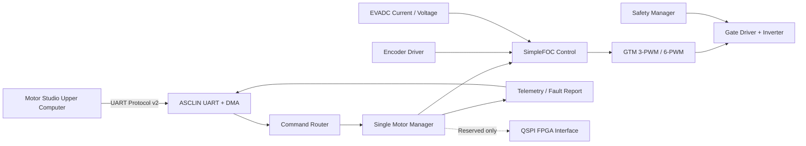
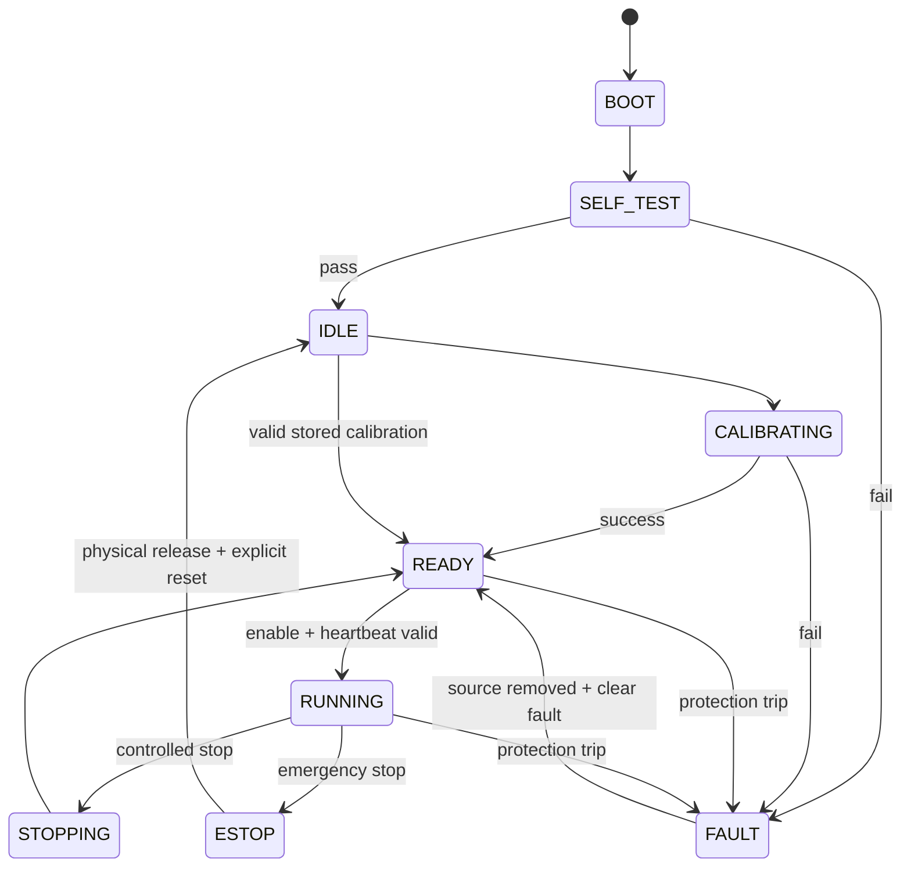

# TC375 Single-Motor Controller Requirements

版本：0.2  
状态：MVP 需求基线  
主控：Infineon AURIX TC375 Lite  
运行环境：FreeRTOS  
控制方案：MCU 单电机 SimpleFOC  
通信：原生 UART 协议 v2，micro-ROS 延后  
FPGA：仅预留 QSPI 和硬件信号，不实现 FPGA 控制

## 1. 本次需求收敛

本项目第一阶段只完成一台 PMSM/BLDC 电机的 MCU 闭环控制。

明确取消或延后：

- 取消 MCU 多电机并行控制。
- 取消多电机协同、同步轨迹和资源动态分配。
- 暂不实现 FPGA 内部 FOC、PWM 或 FPGA 固件。
- 暂不把 micro-ROS 作为 MVP 必选项。
- 暂不实现运行中 MCU/FPGA 后端切换。

保留：

- TC375 + FreeRTOS 基础平台。
- UART 接收上位机控制和调参命令。
- SimpleFOC 单电机电流/转矩、速度、位置控制。
- 电流、速度、位置三环参数读写。
- ADC、编码器、PWM、故障和数据采集。
- QSPI、同步、故障、复位等 FPGA 硬件接口预留。
- 后续在 FreeRTOS 上增加 micro-ROS UART/Ethernet transport 的可能。

## 2. FreeRTOS 与 micro-ROS 的关系

FreeRTOS 是 MCU 的实时操作系统，ROS 2 是主机侧通信和机器人软件框架，
两者不是替代关系。micro-ROS 可以作为 FreeRTOS 上的一个通信任务运行。

项目采用以下顺序：

1. 首先完成 FreeRTOS、原生 UART 协议和单电机闭环。
2. 证明 FOC 快环和通信任务能够稳定共存。
3. 再评估 micro-ROS 静态库交叉编译和 Agent 通信。
4. micro-ROS 接入后仍通过同一个命令路由器控制电机。

MVP 不依赖 ROS 2 或 micro-ROS 即可独立运行。

## 3. 总体架构



### 3.1 软件分层

| 层 | 责任 |
|---|---|
| `bsp` | 时钟、引脚、多核启动、看门狗、FreeRTOS port |
| `drivers` | GTM PWM、EVADC、编码器、UART、QSPI、Flash、gate driver |
| `simplefoc_port` | SimpleFOC 的 TC375 时间、PWM、ADC、传感器适配 |
| `motor` | 唯一电机实例、控制模式、目标、参数和状态 |
| `safety` | 限值、通信超时、故障锁存、PWM/gate 关断 |
| `communication` | UART parser、命令路由、ACK、遥测和心跳 |
| `storage` | 参数版本、CRC、Flash A/B 镜像 |
| `app` | 启动流程和 FreeRTOS 任务创建 |

推荐目录：

```text
lower_computer/
  board/tc375_lite/
  firmware/
    app/
    bsp/
    communication/
    motor/
    safety/
    simplefoc_port/
    storage/
  drivers/
    adc/
    encoder/
    gate_driver/
    pwm/
    qspi_fpga/
    uart/
  protocol/
  tests/
    unit/
    integration/
    hil/
  docs/
```

## 4. FreeRTOS 需求

### 4.1 移植范围

- 使用 TC375 支持的 FreeRTOS TriCore port。
- 所有正式任务使用静态创建接口。
- 禁止运行期间动态创建电机对象。
- 启用栈溢出检测、任务运行时间统计和 stack watermark。
- 中断优先级与可调用 FreeRTOS API 的优先级边界必须记录。
- CPU/安全看门狗不得被简单关闭，应由健康任务定期服务。

### 4.2 推荐任务

| 任务/中断 | 初始频率 | 优先级 | 责任 |
|---|---:|---:|---|
| PWM/ADC/FOC ISR | 20 kHz | 最高 | 采样、FOC、PWM 更新 |
| Safety fast ISR/task | ≥10 kHz | 很高 | 过流、失步、gate fault |
| Motor outer loop | 1 kHz | 高 | 速度/位置控制与目标斜坡 |
| Command task | 1 kHz | 中高 | 校验并提交最新命令 |
| UART RX/TX task | 事件驱动 | 中 | DMA 收发和帧解析 |
| Telemetry task | 100 Hz | 低 | 状态快照和上报 |
| Storage task | 按需 | 最低 | 禁用状态下保存参数 |

FOC 快环可以由硬件中断直接运行，不要求放入普通 FreeRTOS task。
ISR 内不得执行阻塞、日志、Flash、UART 发送或动态内存操作。

### 4.3 多核建议

第一版优先减少多核复杂度：

- Core 0：FreeRTOS、单电机控制和应用任务。
- Core 1：保持安全 idle，后续可放 Ethernet/micro-ROS。
- Core 2：保持安全 idle，后续可放诊断或 FPGA 服务。

只有 Core 0 的 WCET 或通信负载无法满足要求时，才启用其他内核。
跨核通信必须使用有界 mailbox，不直接共享可变控制对象。

## 5. SimpleFOC 移植需求

### 5.1 移植策略

TC375 不在 SimpleFOC 官方开箱即用 MCU 列表内，因此需要建立
`simplefoc_port/tc375` 硬件适配层。第一阶段使用一个静态
`BLDCMotor` 实例。

采用：

- SimpleFOC 的电机对象和控制算法结构。
- `BLDCDriver3PWM` 或功率板需要的 `BLDCDriver6PWM`。
- 编码器/磁编码器自定义 Sensor。
- 自定义 CurrentSense 或 TC375 低侧采样实现。
- `TorqueControlType::foc_current` 作为最终闭环目标。

不采用：

- Arduino `analogRead/analogWrite`。
- Arduino `micros/delay`。
- 未经测量的通用 PWM/ADC 实现。
- SimpleFOC Commander 作为正式线协议。

### 5.2 TC375 HAL 必须实现

时间：

- `_micros()`：单调递增，处理计数器回绕。
- `_delay()` / `_delayMicroseconds()`：仅用于初始化，控制中不阻塞。

PWM：

- GTM 中心对齐 3-PWM，按功率板决定是否扩展为 6-PWM。
- 互补 PWM、死区、最小脉宽和同步更新。
- PWM enable/disable 与 gate enable 分离。
- 上电、复位和故障时输出为安全状态。

ADC/CurrentSense：

- EVADC 由 PWM 在确定采样点触发。
- 支持两电阻或三电阻低侧采样，最终取决于功率板。
- DMA 或确定性 ISR 读取采样结果。
- 零偏、每相增益、符号和通道映射校准。
- ADC 饱和、采样窗口无效和缺相检测。
- 将相电流提供给 SimpleFOC d/q 电流计算。

Sensor：

- 通过统一接口提供机械角、连续多圈角和速度。
- 保存编码器方向、电角度零位和极对数。
- 对跳变、通信 CRC、超时和不合理速度进行检测。

### 5.3 唯一电机实例

```cpp
static BLDCMotor motor(MOTOR_POLE_PAIRS);
static Tc375BLDCDriver driver;
static Tc375CurrentSense current_sense;
static Tc375Encoder sensor;
```

虽然只支持一个实例，驱动代码仍不得把所有状态散落为无命名全局变量。
所有硬件配置集中于 `MotorHardwareConfig`，所有用户参数集中于
`MotorControlConfig`。

### 5.4 控制模式

| 模式 | 上位机目标 | SimpleFOC 映射 |
|---|---|---|
| `TORQUE` | N·m | 根据转矩常数换算为 q 轴电流 |
| `SPEED` | rad/s | `MotionControlType::velocity` |
| `POSITION` | rad，多圈 | `MotionControlType::angle` |

内部还保留调试模式：

- `CURRENT_DQ`：直接设置 `id/iq`，仅调试人员可用。
- `VOLTAGE_OPEN_LOOP`：仅限首次无负载验证，正式构建默认关闭。

### 5.5 三环参数

上位机继续提供三个下拉选项：

- 电流环：MVP 同时更新 d/q 电流 PI；下位机内部可保存独立 d/q 参数。
- 速度环：速度 PI/PID。
- 位置环：位置 P/PID。

每组参数包括：

- `kp`, `ki`, `kd`。
- 输出限值。
- 积分限值。
- 低通滤波时间常数。
- anti-windup 配置。

参数先写 shadow，在控制周期边界原子生效。只有收到 `SAVE_CONFIG`
且电机处于禁用状态时才写 Flash。

## 6. 单电机状态机



要求：

- 任何复位后不得自动恢复运行。
- `ENABLE` 只在 `READY` 且心跳有效时接受。
- 未完成电流和编码器校准时禁止闭环运行。
- 切换控制模式时执行目标斜坡和积分器复位策略。
- `ESTOP` 优先使用硬件 gate 关断。

## 7. 上下位机通信

MVP 使用原生 UART 协议 v2，完整定义见：

[Native Protocol v2](../protocol/NATIVE_PROTOCOL_V2.md)

### 7.1 UART

- TC375 ASCLIN。
- 默认 115200 baud，支持配置 460800/921600。
- 8 data bits、no parity、1 stop bit。
- RX 使用 DMA 环形缓冲或等效无阻塞方案。
- TX 使用队列和 DMA。
- parser 支持拆包、粘包、噪声和 CRC 错误恢复。
- 控制帧优先于遥测帧发送。

### 7.2 心跳

- 上位机连接后每 250 ms 发送 `HEARTBEAT`。
- 默认命令租约 750 ms。
- 电机使能时心跳超时进入 `QUICK_STOP`，随后失能并锁存通信故障。
- 未使能时心跳超时只更新通信状态。
- 重新收到心跳不能自动清除故障或重新使能。

### 7.3 单电机地址

- 唯一电机地址固定为 `1`。
- `0xFF` 仅用于广播急停和广播失能。
- 其他地址返回 `INVALID_DEVICE`。
- 上位机不再显示 M2–M8。

### 7.4 micro-ROS 延后接口

后续 micro-ROS 接入时：

- 使用 FreeRTOS 上的静态 micro-ROS Client 库。
- 优先 Ethernet UDP；UART XRCE 作为备选。
- micro-ROS callback 只产生内部 `CommandEnvelope`。
- 原生 UART 和 micro-ROS 使用同一个命令校验与状态机。
- micro-ROS 不进入 FOC ISR。

## 8. 必需命令

### 8.1 系统

- `PING`
- `GET_DEVICE_INFO`
- `GET_CAPABILITIES`
- `HEARTBEAT`
- `GET_DIAGNOSTICS`
- `GET_RESET_REASON`

### 8.2 控制

- `SET_ENABLE`
- `SET_MODE`
- `SET_TARGET`
- `CONTROLLED_STOP`
- `QUICK_STOP`
- `EMERGENCY_STOP`
- `CLEAR_FAULT`

### 8.3 调参与校准

- `SET_PID`
- `GET_PID`
- `SET_LIMITS`
- `GET_LIMITS`
- `CALIBRATE_CURRENT`
- `CALIBRATE_ENCODER`
- `CALIBRATE_ALL`
- `ZERO_POSITION`
- `SAVE_CONFIG`
- `RESTORE_DEFAULTS`

### 8.4 遥测

- `SET_TELEMETRY_PROFILE`
- `GET_TELEMETRY_PROFILE`
- `TELEMETRY`
- `FAULT_EVENT`
- `START_FAST_CAPTURE`
- `STOP_FAST_CAPTURE`

## 9. 安全需求

### 9.1 必须检测

- 硬件和软件过流。
- 母线过压/欠压。
- 电机、功率器件和板卡过温。
- 编码器超时、跳变、CRC/奇偶错误。
- ADC 饱和、零偏异常和采样不同步。
- 过速和位置软限位。
- gate driver fault。
- 心跳/命令租约超时。
- FOC ISR deadline miss。
- FreeRTOS 栈溢出、任务卡死和 watchdog。

### 9.2 故障动作

| 等级 | 动作 |
|---|---|
| `WARNING` | 记录和告警，允许降额 |
| `CONTROLLED_STOP` | 按配置斜坡降到零并失能 |
| `QUICK_STOP` | 快速置零并关闭 PWM |
| `IMMEDIATE_SHUTDOWN` | 硬件关闭 gate |
| `ESTOP_LATCHED` | 需要物理释放和显式复位 |

网络急停不能替代硬件急停。MCU 必须拥有不经过通信软件的 gate
关断通路。

## 10. 参数与 Flash

- 参数带 schema version、generation、hardware revision 和 CRC32。
- 使用 A/B 两份镜像。
- 写入新镜像并校验成功后再切换 generation。
- 两份均无效时加载安全默认值，电机保持禁用。
- 工厂校准和用户调参分开存储。
- Flash 擦写只允许在电机禁用时进行。
- `RESTORE_DEFAULTS` 不自动保存，也不自动使能。

## 11. FPGA 接口预留

MVP 不实现 FPGA FOC，不编写 FPGA 逻辑，也不允许选择 FPGA 运行模式。

### 11.1 硬件信号

必须在原理图、引脚表和 BSP 中预留：

- `FPGA_QSPI_SCLK`
- `FPGA_QSPI_MOSI`
- `FPGA_QSPI_MISO`
- `FPGA_QSPI_CS`
- `FPGA_PWM_SYNC`
- `FPGA_READY`
- `FPGA_FAULT`
- `FPGA_RESET`
- `MCU_GATE_ENABLE`

未安装 FPGA 时，这些输入具有确定的上拉/下拉状态，不得产生误故障。

### 11.2 软件接口

预留但不启用：

```c
typedef struct
{
    bool (*init)(void);
    bool (*self_test)(void);
    bool (*transfer)(const void *tx, void *rx, uint16_t length);
    void (*reset)(void);
    uint32_t (*get_faults)(void);
} FpgaLinkOps;
```

BSP 完成 QSPI 基础初始化和 loopback 测试即可。正式控制帧和 FPGA
后端在后续阶段单独冻结。

上位机的 `GET_CAPABILITIES` 在 MVP 中返回：

- `motor_count = 1`
- `backend = MCU`
- `fpga_reserved = true`
- `fpga_control_available = false`

## 12. 遥测

常规遥测至少包括：

- 电机状态和控制模式。
- 目标/实际速度和位置。
- 估算转矩或 q 轴电流。
- 相电流或 d/q 电流。
- 母线电压。
- 温度。
- 编码器状态。
- PWM duty。
- warning/fault bitmask。
- 最近命令序号和命令年龄。
- FOC 周期、最大执行时间和 deadline miss。

常规频率默认 100 Hz。高速采集使用预分配环形缓存，带宽不足时丢弃
遥测，不得阻塞控制。

## 13. 实施阶段

### Phase 0：FreeRTOS 和硬件基础

- TC375 启动、FreeRTOS、watchdog。
- ASCLIN UART DMA。
- GTM 安全 PWM。
- EVADC 触发与采样。
- 编码器读取。
- QSPI loopback 和预留引脚测试。

### Phase 1：SimpleFOC 开环与校准

- TC375 SimpleFOC HAL。
- 唯一电机实例。
- 低电压开环验证。
- ADC 零偏和编码器方向/零位校准。

### Phase 2：单电机闭环

- d/q 电流闭环。
- 速度闭环。
- 位置闭环。
- 目标斜坡、限值和状态机。
- 故障注入。

### Phase 3：上位机联调

- 原生协议 v2。
- 心跳、ACK、错误码。
- 三环调参和参数保存。
- 遥测和故障事件。
- 8 小时稳定性测试。

### Phase 4：可选 micro-ROS

- FreeRTOS micro-ROS 静态库。
- Ethernet UDP transport。
- Agent 重连与内存/时序测试。
- 将 ROS message 转换为现有 `CommandEnvelope`。

## 14. 验收标准

### 14.1 基础软件

- FreeRTOS 连续运行 24 小时，无栈溢出、watchdog 或内存增长。
- UART 在随机拆包、粘包、噪声、CRC 错误后能够恢复。
- 拔出/恢复串口不影响控制中断。

### 14.2 电机控制

- 上电保持 PWM/gate 安全状态。
- 完成电流零偏和编码器校准。
- 电流、速度、位置模式分别通过阶跃和限值测试。
- 20 kHz 初始 FOC 目标下，最坏执行时间小于周期的 60%。
- 修改 PI/PID 时不产生半更新或突变失控。
- 通信断开、编码器异常、过流、过温均执行规定动作。

### 14.3 上位机协议

- 上位机只显示一个电机。
- 连接后自动查询版本和能力并持续心跳。
- 三环 PID 可以独立读写。
- 保存参数、恢复默认、校准、清故障都有明确 ACK/ERROR。
- 错误设备地址、非法状态、越限目标和 CRC 错误被拒绝。

### 14.4 FPGA 预留

- QSPI 引脚和基础驱动能够完成 loopback。
- FPGA 相关输入在悬空/未安装时状态确定。
- `GET_CAPABILITIES` 明确报告 FPGA 控制不可用。
- 电机控制代码不依赖 FPGA 存在。

## 15. 开始编码前仍需确认

1. 功率板和 gate driver 型号。
2. 电机极对数、相电阻/电感、转矩常数、额定/峰值电流。
3. 母线电压、PWM 频率和最大转速。
4. 两电阻还是三电阻低侧采样，采样电阻和放大倍数。
5. 编码器类型和接口。
6. 使用 3-PWM 还是 6-PWM。
7. AURIX 编译器及 FreeRTOS TriCore port 来源。
8. UART 最终波特率。
9. 硬件急停和制动策略。
10. FPGA 预留引脚是否与当前板卡其他功能冲突。

## 16. 官方参考

- [Infineon TC375 Lite Kit](https://www.infineon.com/cms/en/product/promopages/AURIX-microcontroller-boards/low-cost-arduino-kits/aurix-tc375-lite-kit/)
- [Infineon TC3xx PMSM FOC](https://documentation.infineon.com/aurixtc3xx/docs/kbv1711616051757)
- [SimpleFOC supported microcontrollers](https://docs.simplefoc.com/microcontrollers)
- [SimpleFOC current sensing](https://docs.simplefoc.com/current_sense)
- [SimpleFOC low-side current sensing](https://docs.simplefoc.com/low_side_current_sense)
- [micro-ROS custom transports](https://micro.ros.org/docs/tutorials/advanced/create_custom_transports/)
