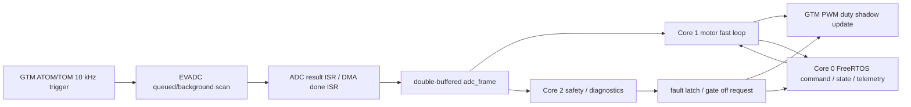

# TC375 Low-Level Configuration Plan

版本：0.1  
状态：底层配置计划草案  
目标芯片：Infineon AURIX TC375 Lite / TC37x  
底层库：AURIX Development Studio `tricore-tc3xx` `1.16-17`，iLLD `1.0.1.20.0`

## 1. 目标

第一阶段建立 TC375 最底层的确定性采样和控制基础：

- 使用 GTM 产生 10 kHz 硬件时间基准。
- 使用 GTM 触发 EVADC，在固定采样点同步采集 6 路 ADC。
- 建立 ADC 结果双缓冲、时间戳、有效性检查和故障标志。
- 明确三核分工，主核运行命令、状态机、遥测和健康任务。
- 为后续 SimpleFOC 电流环、速度环和位置环提供稳定 HAL 数据入口。

核心原则：采样动作由 GTM/EVADC 硬件完成，CPU 不用 task 去“采样”。
CPU 只处理采样完成后的结果搬运、校准、滤波、保护和控制计算。

## 2. 对当前想法的改进

原始想法：

- GTM 生成 10 kHz ADC trigger。
- 同步采样 6 个 ADC。
- 三个核心每个分配两个采样任务。
- 主核同时运行 command 等任务。

建议改成：

- GTM 作为唯一硬件节拍源，触发 EVADC 同步采样。
- EVADC 每 100 us 完成 6 路采样，结果进入固定结果寄存器或 DMA 缓冲。
- 一个高优先级 ADC done ISR 只做很短的工作：读取结果、打时间戳、切换双缓冲、置 ready flag。
- 三核不直接分摊“采样任务”，而是分摊“采样后的计算任务”。
- Core 0 保持系统主控：FreeRTOS、命令、状态机、遥测、看门狗、参数保存。
- Core 1 运行电机快环：ADC 后处理、Clarke/Park、FOC、电流环、PWM duty 更新。
- Core 2 运行安全和诊断：快速保护复核、数据采集、统计、后续 FPGA/QSPI 或 micro-ROS 预留。

这样做的好处是采样相位完全由硬件保证，跨核同步只发生在清晰的缓冲边界，
不会因为 FreeRTOS 调度或跨核 cache/总线竞争改变 ADC 采样时刻。

## 3. 推荐总体架构



## 4. 时间基准

初始配置：

| 项目 | 建议值 | 说明 |
|---|---:|---|
| GTM ADC trigger | 10 kHz | 每 100 us 触发一次同步采样 |
| 电机快环 | 10 kHz | 第一版与 ADC trigger 同频 |
| 外环速度/位置 | 1 kHz | FreeRTOS task 或 Core 1 低频分频 |
| 遥测 | 100 Hz | Core 0 发送快照，不阻塞控制 |
| 命令处理 | 1 kHz 或事件驱动 | UART RX DMA + parser |
| 健康/看门狗 | 100 Hz | Core 0 服务系统 watchdog |

如果后续电流环带宽或 PWM 纹波要求更高，再评估升到 20 kHz。
第一版 10 kHz 更适合先把触发链、ADC 校准、安全保护和通信跑稳定。

## 5. GTM 配置计划

GTM 需要承担两个角色：

- PWM 生成：按 DRV8313 入口生成三路 3-PWM，相当于 U/V/W 三相高边输入占空比。
- ADC trigger：在 PWM 周期内的稳定采样窗口触发 EVADC。

建议：

- 使用 GTM ATOM/TOM 建立中心对齐 PWM。
- ADC trigger 放在 PWM 中点附近，避开开关沿、死区和电流采样放大器恢复时间。
- 使用 shadow register 同步更新 PWM duty，避免半周期内更新造成毛刺。
- gate enable 和 PWM enable 分离，上电默认 gate off、PWM safe state。
- ADC trigger 与 PWM counter 同源，避免软件 timer 造成采样相位漂移。

需要冻结的硬件参数：

- PWM 模式：DRV8313 3-PWM 单输入模型。
- PWM 引脚：U/V/W 分别映射到 P02.0/P02.1/P02.2；不使用 GTM 互补输出引脚。
- gate driver dead time 要求：由 DRV8313 硬件内部逻辑负责，MCU 不插入 DTM dead-time。
- 最小有效脉宽和最大 duty 限制。
- trigger 到 ADC sample-and-hold 的延迟。

## 6. EVADC 配置计划

6 路 ADC 暂按以下类别规划，实际通道待原理图确认：

| 类别 | 数量 | 用途 |
|---|---:|---|
| 相电流 | 3 | phase A/B/C current，或两电阻方案中的两个相电流加重构 |
| 母线电压 | 1 | bus voltage protection and telemetry |
| 温度/功率板状态 | 1 | inverter or board temperature |
| 预留/辅助 | 1 | gate driver analog fault、母线电流或其它传感 |

EVADC 建议：

- 6 路通道使用同一个 GTM trigger 启动。
- 尽可能使用多个 EVADC group 并行采样，减少通道串行转换时间。
- 每路使用固定 result register，避免读错通道。
- ADC ISR 检查 result valid、overrun、同步窗口是否过期。
- 原始 ADC count 先进入 `AdcRawFrame`，再转换为工程单位。
- 电流零偏、gain、sign 和 phase mapping 全部放在校准表里，不写死在 ISR。

ADC frame 建议结构：

```c
typedef struct
{
    uint32_t sequence;
    uint32_t trigger_time_us;
    uint16_t raw[6];
    uint16_t status_bits;
    bool valid;
} Tc375AdcRawFrame;
```

转换后给控制层：

```c
typedef struct
{
    float ia;
    float ib;
    float ic;
    float bus_voltage;
    float temperature;
    float aux;
    uint32_t sequence;
    bool valid;
} Tc375AdcSampleFrame;
```

## 7. 三核分工

### 7.1 推荐分工

| 核心 | 角色 | 主要工作 |
|---|---|---|
| Core 0 | system / command core | FreeRTOS、UART、command router、状态机、遥测、Flash、watchdog |
| Core 1 | motor real-time core | 10 kHz ADC frame 消费、FOC、电流环、PWM duty 更新、fast deadline 统计 |
| Core 2 | safety / diagnostics core | 快速保护复核、慢速滤波、fast capture、QSPI/FPGA 预留、后续 micro-ROS/Ethernet 评估 |

### 7.2 为什么不建议每核两个 ADC task

ADC 采样不是 CPU 任务，而是硬件事件：

- task 调度会引入 jitter，不适合作为采样时刻来源。
- 6 路 10 kHz ADC 数据量很小，单核读取完全够用。
- 真正有价值的并行是后处理和保护，不是分散读取 ADC。
- 多核同时读 ADC result register 容易引入所有权混乱。

如果确实希望三核都参与 ADC 数据处理，可以这样分：

- ISR 统一发布完整 `AdcRawFrame`。
- Core 1 处理相电流 `ia/ib/ic` 和 FOC。
- Core 2 处理 `bus_voltage/temperature/aux` 和保护滤波。
- Core 0 只读取快照用于遥测和状态机，不参与快环计算。

## 8. 跨核通信

跨核通信只允许通过固定大小、无动态内存的数据结构：

- ADC 双缓冲：ISR 写，Core 1 读。
- 控制命令 mailbox：Core 0 写，Core 1 在周期边界取。
- 状态快照 mailbox：Core 1 写，Core 0 读。
- fault latch：任意核心可置位，只能由 Core 0 在安全状态下清除。

建议规则：

- 快环数据使用 sequence number 检查是否丢帧。
- Core 1 控制周期内不等待 Core 0 或 Core 2。
- Core 0 改控制参数时先写 shadow，Core 1 在周期边界原子切换。
- Flash、UART、日志、printf 不得进入 Core 1 快环。

## 9. 中断优先级

建议从高到低：

1. 硬件急停 / gate driver fault / SMU alarm。
2. GTM/EVADC 采样完成 ISR。
3. PWM update / motor fast loop 相关 ISR。
4. UART RX DMA / ASCLIN service。
5. FreeRTOS tick。
6. telemetry、storage、diagnostics 等普通任务。

ADC/FOC ISR 内禁止：

- 阻塞等待。
- 调用普通 FreeRTOS API。
- 动态内存分配。
- UART 发送。
- Flash 操作。
- 长时间浮点日志或格式化字符串。

## 10. 初始化顺序

建议启动顺序：

1. Core 0 启动，关闭 gate，PWM 输出进入安全状态。
2. 初始化 clock、watchdog、SMU、trap hook。
3. 初始化 GTM 基础时钟，但暂不输出 PWM。
4. 初始化 EVADC group、channel、result register 和 GTM trigger source。
5. 初始化 ASCLIN UART/DMA。
6. 初始化跨核 shared buffer、mailbox 和 fault latch。
7. 启动 Core 1 和 Core 2，等待 ready handshake。
8. Core 1 初始化 motor fast loop，但保持 PWM disabled。
9. Core 2 初始化 safety/diagnostics。
10. Core 0 创建 FreeRTOS 静态任务。
11. 运行 ADC trigger dry-run：gate off、PWM safe、采集 6 路 ADC raw。
12. 校验 ADC sequence、周期、零偏范围和无 overrun 后进入 `IDLE`。

## 11. Bring-Up 阶段

### Phase A：无功率输出 ADC bring-up

- `MOTOR_REAL_HARDWARE_ENABLED=0`。
- gate off。
- GTM 只输出 ADC trigger，不打开实际 PWM gate。
- 采集 6 路 raw ADC，检查 10 kHz sequence 是否连续。
- 记录 min/max/mean/stddev，确认零偏和噪声水平。

### Phase B：PWM safe waveform

- gate 仍 off。
- 输出 PWM 到 MCU 引脚，用示波器确认频率、中心对齐、U/V/W 相序和 trigger 位置。
- DRV8313 模式下 MCU 只输出三路 PWM 输入，不检查 MCU 低边互补和 DTM dead-time。
- 确认 ADC trigger 不落在 PWM 边沿附近。

### Phase C：低压开环

- 低母线电压、限流电源。
- gate enable 只允许手动命令进入。
- SimpleFOC voltage open-loop，小 duty、小电流。
- 验证相序、电流符号、编码器方向。

### Phase D：闭环电流

- 启用 d/q 电流环。
- 限制 q 轴电流和 duty。
- 注入小阶跃，观察电流响应和保护动作。

## 12. 需要新增或落地的代码模块

当前采用 ADS 标准工程作为 BSP 基线：`Libraries/` 保持 Infineon iLLD/Infra/Service 原样，`Configurations/` 保持 ADS 生成配置，用户已在 ADS 中验证过的底层入口保持在 `firmware/bsp/tc37a_ads/` 工程根目录。PWM、DRV8313、EVADC、安全逻辑属于项目 BSP，不属于 iLLD vendor 代码。

当前落地方式：

```text
firmware/bsp/tc37a_ads/
  Configurations/
  Libraries/
  Lcf_*.lsl
  Cpu0_Main.c
  Cpu1_Main.c
  Cpu2_Main.c
  GTM_ATOM_3_Phase_Inverter_PWM.c/.h
  DRV8313_handle.c/.h
  tc375_hal_ads.c              # 对接 tc375_hal.h 的 ADS/iLLD HAL
```

### 12.1 DRV8313 PWM 约定

DRV8313 入口采用 3PWM 单输入模型：每相只送入一个 PWM，硬件内部产生互补低边逻辑。因此 `GtmAtom3phInv_setDuty(dutyU, dutyV, dutyW)` 的 duty 表示对应相的高边/PWM 输入占空比，单位为 `%`，范围由宏 `GTM_ATOM_3PH_INV_DUTY_MIN_PERCENT` 和 `GTM_ATOM_3PH_INV_DUTY_MAX_PERCENT` 限幅。当前默认 `0..100%`。

当前相序约定：

| API 相位 | GTM 通道 | 输出 pin | 语义 |
|---|---:|---|---|
| U | ATOM1 CH0 | P02.0 / TOUT0 | DRV8313 U 相 PWM 输入，高边导通比例 |
| V | ATOM1 CH1 | P02.1 / TOUT1 | DRV8313 V 相 PWM 输入，高边导通比例 |
| W | ATOM1 CH2 | P02.2 / TOUT2 | DRV8313 W 相 PWM 输入，高边导通比例 |

不再配置 GTM complementary pin，也不再由 iLLD DTM 插入死区。互补低边和保护时序由 DRV8313 硬件负责。FOC 适配层传入的是 `0..1` duty，`tc375_hal_ads.c` 转成 `0..100%` 后调用 BSP。

### 12.2 PWM 更新策略

当前 `GtmAtom3phInv_setDuty()` 使用 `IfxGtm_Pwm_updateChannelsDutyImmediate()`，这是开环 bring-up 阶段的临时策略，便于示波器和低压相序测试快速看到响应。进入闭环 FOC、电流采样同步和真实负载测试前，应切换到同步 shadow update，在 PWM 周期边界统一更新三相 duty，避免半周期内更新造成毛刺或采样相位漂移。

### 12.3 SimpleFOC 开环测试入口

SimpleFOC 保持在 `firmware/simplefoc_port/`，通过 C 边界隔离 C++ 库对象。当前新增开环入口：

```c
bool SimpleFocTc375_OpenLoopInit(float bus_voltage_v, float voltage_limit_v);
void SimpleFocTc375_OpenLoopStep(float target_velocity_rad_s);
void SimpleFocTc375_OpenLoopStop(void);
```

开环测试采用 `velocity_openloop + voltage` 模式，不绑定编码器和电流采样，也不调用 `initFOC()`。ADS 的 `Cpu0_Main.c` 默认仍保持安全零 duty；需要测试时再打开 `BSP_SIMPLEFOC_OPEN_LOOP_TEST=1`，并在确认低压限流、电机固定、安全停机路径和相序后，才允许 `MOTOR_REAL_HARDWARE_ENABLED=1` 输出真实 PWM。

优先实现顺序：

1. ADS 工程基线校验：确认芯片型号、链接脚本、启动文件、iLLD 版本和 include path。
2. GTM PWM/timing：保持 DRV8313 3PWM 单输入模型，先跑 20 kHz 中心对齐 PWM 和安全零 duty。
3. SimpleFOC 低压开环：小 `voltage_limit`、小速度，验证 U/V/W 相序、电机旋转方向和 fault 关断。
4. EVADC：接入 6 路同步采样、固定 result register、valid/overrun 检查和 raw frame。
5. Multicore：Core 0/1/2 启动、ready handshake、共享 buffer 和 mailbox。
6. Safety/HAL：fault latch、gate off、deadline miss，并把 `tc375_hal.h` 中 ADC、编码器、ASCLIN、Flash 接到真实 iLLD 实现。

## 13. 测试和验收

必须能测到：

- 10 kHz ADC trigger 周期稳定，jitter 满足控制要求。
- 6 路 ADC sequence 连续，无 overrun。
- ADC trigger 相位与 PWM 波形关系正确。
- Core 1 快环最坏执行时间小于 100 us 的 60%，即小于 60 us。
- Core 0 UART 大量通信时不影响 ADC sequence。
- Core 2 诊断或 fast capture 开启时不影响 Core 1 deadline。
- 任意 fault latch 置位后，gate 能在规定时间内关闭。

建议记录：

- `adc_sequence_miss_count`
- `adc_overrun_count`
- `fast_loop_max_us`
- `fast_loop_deadline_miss_count`
- `pwm_update_late_count`
- `cross_core_mailbox_drop_count`
- `fault_latch_bits`

## 14. 当前未决问题

开始写真实 iLLD 配置前需要确认：

1. 6 路 ADC 的实际信号名称和 TC375 EVADC 通道号。
2. 电流采样拓扑：三电阻、两电阻还是 inline current sense。
3. PWM 输出：3-PWM 还是 6-PWM。
4. gate driver 型号、dead time、enable/fault 引脚。
5. 母线电压范围、ADC 分压比例、过压/欠压阈值。
6. 电流采样电阻、放大倍数、偏置电压、正方向定义。
7. 编码器类型、接口和中断/DMA 需求。
8. 是否需要把 FreeRTOS 只放 Core 0，Core 1/2 裸机循环运行。
9. 10 kHz 是否只是 ADC trigger，还是 PWM/FOC 也固定 10 kHz。
10. 是否需要高速采集原始 ADC 波形给上位机调试。

## 15. 第一版建议结论

第一版不要把 6 路 ADC 拆成三个核心上的六个 task。
更稳的方案是：

- GTM 统一产生 10 kHz trigger。
- EVADC 硬件同步采 6 路。
- 一个 ISR 发布完整采样帧。
- Core 1 做快环和 PWM 更新。
- Core 2 做安全复核和诊断。
- Core 0 继续做命令、状态机、遥测、Flash 和 watchdog。

这样既保留了三核扩展能力，又把最敏感的采样相位和快环路径保持简单、
确定、可测量。
